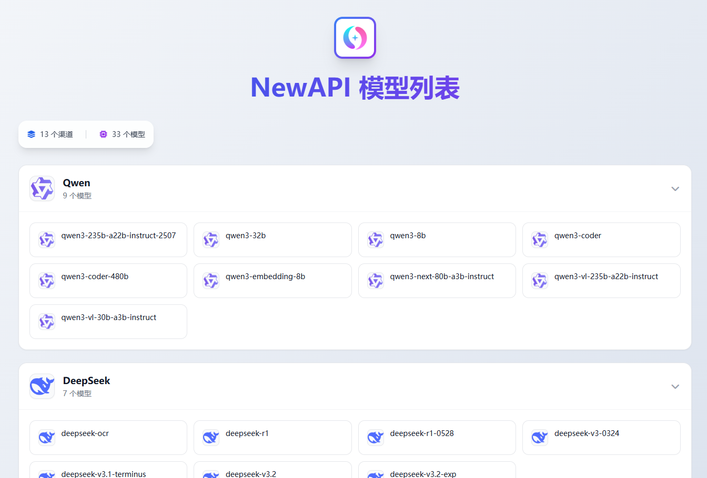

# Model Gallery

将获取到的模型列表按关键词分组展示，专门为 NewAPI 设计，适用于展示 OpenAI 兼容的模型接口

## 🚀 快速开始

### 🦕 deno 部署
1. 登录 [deno](https://dash.deno.com) dashboard
2. 创建一个 New Playground
3. 粘贴 `main.ts` 代码
4. 添加环境变量

### ☁️ Cloudflare Worker 部署
1. 登录 [Cloudflare 控制台](https://dash.cloudflare.com)
2. 进入 **Workers & Pages** 
3. 点击 **创建应用程序** -> **从 Hello World! 开始**
4. 删除默认代码，粘贴 `worker.js` 代码
5. 添加环境变量

## ⚙️ 环境变量
 **变量名** | **说明** | **示例** | **是否必选** 
---|---|---|---
 `API_URL` | AI 模型 API 地址，必须包含 `/v1/models` 路径 | https://api.openai.com/v1/models | 必选 
 `API_KEY` | API 访问密钥 | sk-xxxxxxxxxxxxxxxxxxxxxxxx | 必选 
 `SITE_LINK` | 网站链接，图标点击后跳转的地址 | https://github.com/ZhuBaiwan-oOZZXX/Model-Gallery | 可选 
 `SITE_NAME` | 网站标题，显示在页面顶部 | Model Gallery | 可选 
 `SITE_LOGO` | 网站 Logo 的 URL 地址，显示在页面顶部中央 | https://docs.newapi.pro/assets/logo.png | 可选 
 `SITE_ICON` | 网站图标（favicon）的 URL 地址，显示在浏览器标签页 | https://docs.newapi.pro/assets/logo.png | 可选 

## 🔍 匹配流程
1. **遍历模型**
程序会遍历从 API 获取到的每一个模型名称

2. **关键词匹配**
将模型名称转为小写后，与 `GROUP_CONFIG` 中定义的分组按顺序进行关键词匹配

3. **匹配规则**
- 匹配顺序按照代码中的配置顺序，从上往下进行匹配
- 只要模型名称包含某个分组的任何一个关键词，就会被分配到该分组
- 匹配成功后停止，不再继续匹配其他分组

**示例**：
- `gpt-4-turbo` → 匹配 `OpenAI` 组的 `gpt` 关键词
- `claude-3-opus` → 匹配 `Claude` 组的 `claude` 关键词
- `glm-4` → 匹配 `智谱` 组的 `glm` 关键词
- `unknown-model` → 未匹配到任何关键词，进入 `default` 组

> [!TIP]
> 如果您的模型名称比较混乱，建议在 NewAPI 中的重定向功能修改模型名称，使其更符合分组规则，这样可以获得更好的分组效果。

## ➕ 添加分组
- 修改代码中的 `GROUP_CONFIG` 配置，按照格式添加您需要的分组
- 每个分组包含 `icon`（图标 URL）和 `keywords`（多个匹配关键词），key 将作为组名
- `default` 组为默认分组，未匹配到任何关键词的模型将进入该组

## 🙏 感谢
感谢 [Lobe Icons](https://github.com/lobehub/lobe-icons) 项目提供的精美图标。