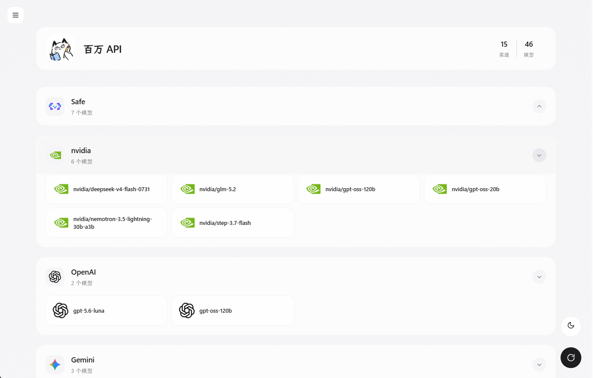
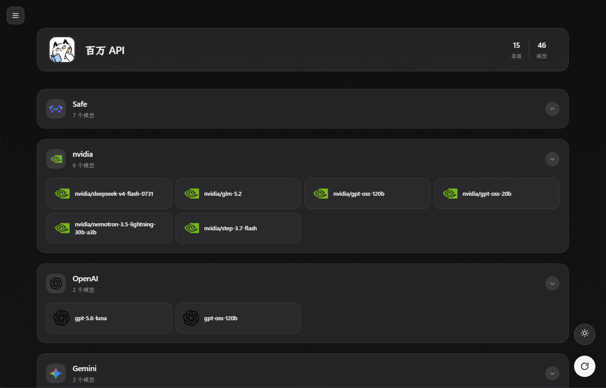

# Model Gallery

一个优雅的 AI 模型列表展示工具，自适应颜色主题，自动将获取到的模型按关键词分组，支持多站点切换。专为 NewAPI、OneAPI、DoneHub 等 OpenAI 兼容接口设计。

| 浅色模式                                 | 深色模式                                |
| ---------------------------------------- | --------------------------------------- |
|  |  |

## 🚀 快速开始

### 本地运行

1. 安装 Node.js 24.x
2. 在项目根目录编辑 `config.json` 文件，填入你的站点配置（参考下方配置说明）
3. 安装依赖并启动开发服务器：
   ```bash
   npm install
   npm run dev
   ```
4. 打开浏览器访问 `http://localhost:3000`

### Vercel 部署

1. Fork 项目到你的 GitHub 账号
2. 登录 [Vercel](https://vercel.com)，点击 `Add New Project`
3. 选择你 Fork 的仓库并导入
4. 在 `Environment Variables` 中添加：
   - **Key**: `CONFIG_JSON`
   - **Value**: 你的配置文件 JSON 内容
5. 点击 `Deploy` 等待部署完成，即可通过 `https://your-project.vercel.app` 访问

## ⚙️ 配置说明

### 配置格式

**最简配置示例（使用默认值）：**

```json
{
  "sites": [
    {
      "name": "我的 NewAPI 站点",
      "apiUrl": "https://api.example.com",
      "apiKey": "sk-xxxxxxxxxxxxxxxxxxxxxxxx"
    }
  ]
}
```

**多站点配置示例：**

```json
{
  "sites": [
    {
      "name": "OpenAI 官方",
      "apiUrl": "https://api.openai.com",
      "apiKey": "sk-openai-key",
      "apiEndpoint": "/v1/models",
      "externalUrl": "https://openai.com",
      "iconUrl": "https://example.com/openai-icon.png"
    },
    {
      "name": "硅基流动",
      "apiUrl": "https://api.siliconflow.cn",
      "apiKey": "sk-siliconflow-key",
      "apiEndpoint": "/v1/models",
      "externalUrl": "https://siliconflow.cn",
      "iconUrl": "https://example.com/siliconflow-icon.png"
    },
    {
      "name": "DeepSeek",
      "apiUrl": "https://api.deepseek.com",
      "apiKey": "sk-deepseek-key",
      "apiEndpoint": "/models",
      "externalUrl": "https://deepseek.com",
      "iconUrl": "https://example.com/deepseek-icon.png"
    }
  ],
  "defaultSite": "硅基流动",
  "customGroupRules": [
    {
      "name": "翻译",
      "icon": "https://example.com/translation.webp",
      "keywords": ["翻译"],
      "position": { "type": "first" }
    },
    {
      "name": "官转",
      "icon": "https://example.com/official.webp",
      "keywords": ["官转"],
      "position": { "type": "before", "target": "DeepSeek" }
    },
    {
      "name": "其他自定义",
      "icon": "https://example.com/custom.webp",
      "keywords": ["其他"],
      "position": { "type": "last" }
    }
  ]
}
```

### 配置字段说明

> [!TIP]
> 配置通过 `CONFIG_JSON` 环境变量或 `config.json` 文件提供，环境变量优先。本地开发时编辑 `config.json`（可参考 `config.example.json`）；Vercel 部署时请将配置内容作为 `CONFIG_JSON` 环境变量的值填入。

#### sites 站点配置

| **字段名**    | **类型** | **说明**                 | **默认值**                                          | **是否必选** |
| ------------- | -------- | ------------------------ | --------------------------------------------------- | ------------ |
| `name`        | String   | 站点名称，显示在页面顶部 | -                                                   | 必选         |
| `apiUrl`      | URL      | API 基础地址             | -                                                   | 必选         |
| `apiKey`      | String   | API 访问密钥             | -                                                   | 必选         |
| `apiEndpoint` | String   | API 端点路径             | `/v1/models`                                        | 可选         |
| `externalUrl` | URL      | 图标点击后跳转的链接     | `https://github.com/ZhuBaiwan-oOZZXX/Model-Gallery` | 可选         |
| `iconUrl`     | URL      | 站点图标                 | `https://docs.newapi.pro/assets/logo.png`           | 可选         |

#### customGroupRules 自定义分组规则配置（可选）

> 以下是自定义分组的规则，如果需要新的分组可以提交 Issue 或 PR 说明。

| **字段名** | **类型** | **说明**                                                                                                                                                                                       | **默认值**                             | **是否必选** |
| ---------- | -------- | ---------------------------------------------------------------------------------------------------------------------------------------------------------------------------------------------- | -------------------------------------- | ------------ |
| `name`     | String   | 分组名称，不能与内置分组或其他自定义分组重复                                                                                                                                                   | -                                      | 必选         |
| `keywords` | String[] | 关键词数组，模型名称包含任意一个关键词时，则匹配到该分组                                                                                                                                       | -                                      | 必选         |
| `icon`     | URL      | 分组图标                                                                                                                                                                                       | LobeHub Icons 默认图标                 | 可选         |
| `position` | Object   | 分组的插入位置。<br>`type`：可选 `first`（最前）、`last`（最后）、`before`（插入到某分组之前）<br>当 `type` 为 `before` 时需指定 `target` 为内置分组名称（大小写不敏感，不支持指定自定义分组） | 若不指定，默认为 `{ "type": "first" }` | 可选         |

<details>
<summary>多个自定义分组的最终顺序</summary>

> **多个自定义分组的最终顺序**：相同 `type` 的自定义分组，按配置文件中的顺序排列（先配置的在前），例如：
>
> - `[{A, first}, {B, first}]` → 结果为 `[A, B, ...原有分组]`
> - `[{A, last}, {B, last}]` → 结果为 `[...原有分组, A, B]`
> - `[{A, before: DeepSeek}, {B, before: DeepSeek}]` → 结果为 `[A, B, DeepSeek, ...]`

</details>

## 💭 匹配流程

> [!TIP]
> 如果您的模型名称比较混乱，建议使用 NewAPI 的重定向功能，修改模型名称使其更符合分组规则，这样可以获得更好的分组效果。

1. **遍历模型**：
   程序会遍历从 API 获取到的每一个模型名称

2. **关键词匹配**：
   将模型名称转为小写后，与分组配置按顺序进行关键词匹配

3. **匹配规则**：
   - 按照分组配置顺序从上往下匹配
   - 只要模型名称包含某个分组的任何一个关键词，就会被分配到该分组
   - 匹配成功后停止，不再继续匹配其他分组

**示例**：

| 模型名称              | 匹配结果                                                                         |
| --------------------- | -------------------------------------------------------------------------------- |
| `gpt-4-turbo`         | 匹配 `OpenAI` 组的 `gpt` 关键词                                                  |
| `claude-3-opus`       | 匹配 `Claude` 组的 `claude` 关键词                                               |
| `glm-4`               | 匹配 `智谱` 组的 `glm` 关键词                                                    |
| `【翻译】deepseek-v3` | 匹配 `翻译` 组的 `翻译` 关键词（因 position 为 first，该分组排在最前，优先匹配） |
| `unknown-model`       | 未匹配到任何关键词，进入 `default` 组                                            |

## 🙏 感谢

感谢 [Lobe Icons](https://github.com/lobehub/lobe-icons) 项目提供的精美图标。
